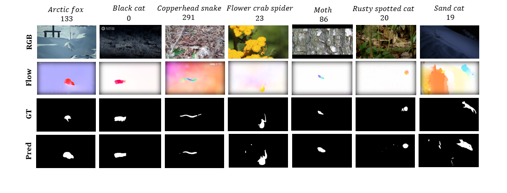
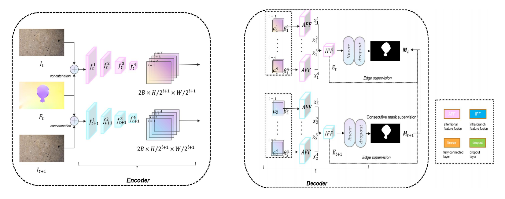

# Deep-learning-model-for-camouflaged-object-detection

This repo is for BSCCS Final Year Project 2023-2024, *Deep-learning model for camouflaged object detection*. [[Final Report](https://drive.google.com/file/d/11mjpbHxS75MrKIQO7vcdAS17SRb7N5iG/view?usp=drive_link)]

* We propose a novel two-branch VCOD model that utilizes both RGB frames and motion estimations as inputs to give dense predictions of targets in a video.
* Different from other methods using implicit motion handling, we continue to use explicit optical flows in spite of acceptable estimation errors, for the purpose of saving computational cost. To this end, we introduce inter-branch feature fusion module to fuse feature maps obtained from two modalities, i.e., RGB frames and optical flow estimations. Besides, we also introduce intra-branch feature fusion module to fuse feature maps at multiple scales in order to get fine-grained features. 
* Our proposed framework is non-trivial, which achieves 39 FPS (> 20 FPS) inference speed with a competitive performance among state-of-the-art methods on VCOD tasks. Our model outperforms the best method in the evaluation by 9.5% on MAE (mean absolute error) with 55.86 MB (67.82%) less parameters. However, we also observe that the state-of-the-art method outperforms our model on all other metrics. 

## 1. Proposed Model

      
    <em>
    Figure 1: Illustration of our model. First, the transformer-based backbone extracts
    features from two consecutive input frames and the corresponding motion estimation.
    Then, the proposed Inter-branch Feature Fusion module and Intra-branch Feature Fusion
    module fuse features from both appearance branch and motion branch.
    </em>

Our model is implemented in [PyTorch](https://github.com/pytorch/pytorch) framework and trained on a single NVIDIA GeForce RTX 3080 GPU of 10240 MiB memory.
